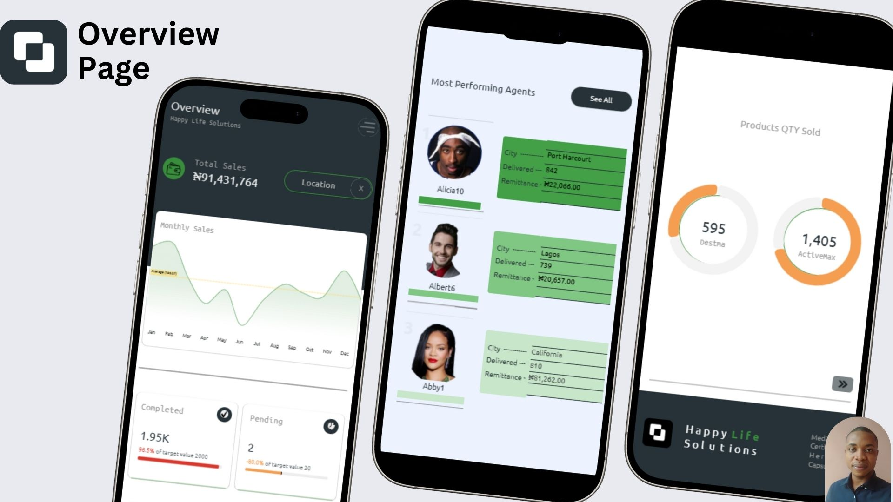
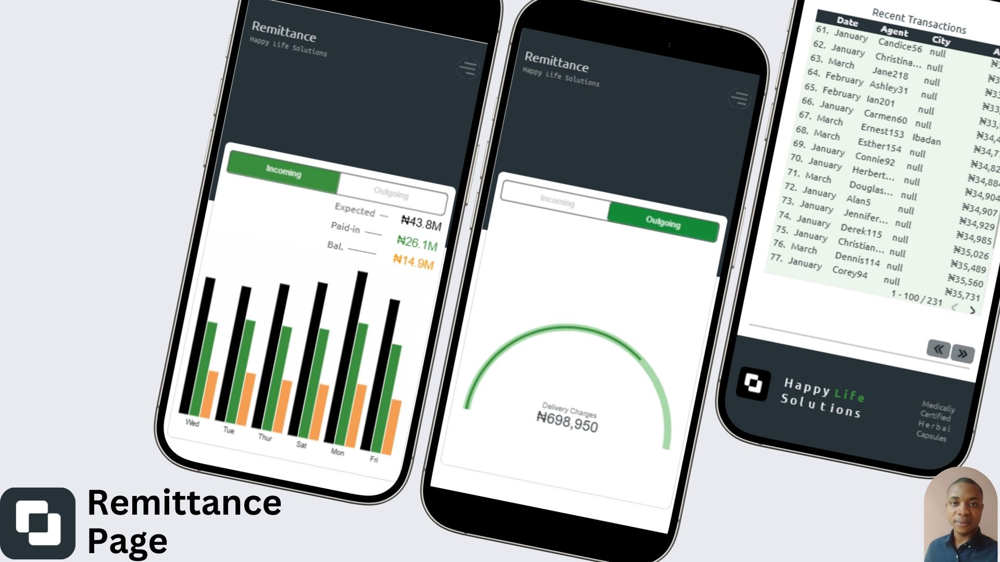

# Project Case Study: Mobile Business Dashboard for Operational Clarity

At Happy Life Solution, a herbal wellness brand with growing operations in Nigeria, keeping track of delivery activities across states is essential. As the logistics coordinator for Rivers State, I’ve been close to the day-to-day operational pain points — scattered updates, missed remittance tracking, and limited visibility into delivery activities.

I saw an opportunity to bring structure and clarity through data.

## The Problem
Despite the hard work from our delivery agents and team leads, there was no streamlined way to answer key questions:

* What’s the status of deliveries this week?
* Which agents have pending remittances?
* Are there patterns in late payments or underperformance?
* What’s our general operational health — in one view?

Information was spread across WhatsApp chats, voice notes, spreadsheets, and memory. It was time consuming, error prone, and reactive. On one particular occasion, one of the stock managers miscounted remaining products by one, leading to a proportional loss of 30% for the last week of February.

## The Solution
I designed a Looker Studio dashboard that pulls key business insights into a single mobile optimized report, that automatically updates records — accessible anytime, anywhere.

Think of it as a live command center for the business — built for speed, ease, and clarity.

The dashboard covers:

1. Overview Page – High level summary of performance and revenue.
2. Delivery Agents Page – Monitor who delivered what, where, and when.
3. Remittance Page – Track outstanding payments, recent transactions, and delivery charges.
4. Inventory Movement Page – Show stock position, flow and reorder timeline - only visible to admin.
5. Orders Page - only visible to admin.

## Why It Works
* Built for Mobile – Most of our team, including managers, use their phones during work. I designed the layout to fit smaller screens without compromising clarity.
* Pop-Out Navigation – Instead of long scrolls, I implemented a clickable menu system that mimics how a website or app feels. One tap, and you’re on the exact page you need.
* Clean, Intentional Design – Fewer charts, more meaning. I used consistent colors, spacing, and clear labels to avoid visual noise and confusion.

## The Impact
1. Faster decisions: Team leads now access critical delivery and remittance insights in under a minute — no digging through files.
2. Improved accountability: Agents know their performance is visible and measurable, which promotes reliability.
3. Greater trust in data: With centralized reporting, we’ve reduced communication gaps and improved collaboration.

## Tools Used
* Looker Studio (Google Data Studio)
* Google Sheets (for backend data entry)
* UX-focused layout planning
* Custom-built pop-out navigation system

## What This Reflects
To me, data is not just numbers — it’s a tool to solve problems. This dashboard was not about showcasing fancy visuals; it was about building a real solution that helps a real business move smarter.

Whether for managers, delivery agents, or finance teams, the goal was clarity, speed, and usability.

